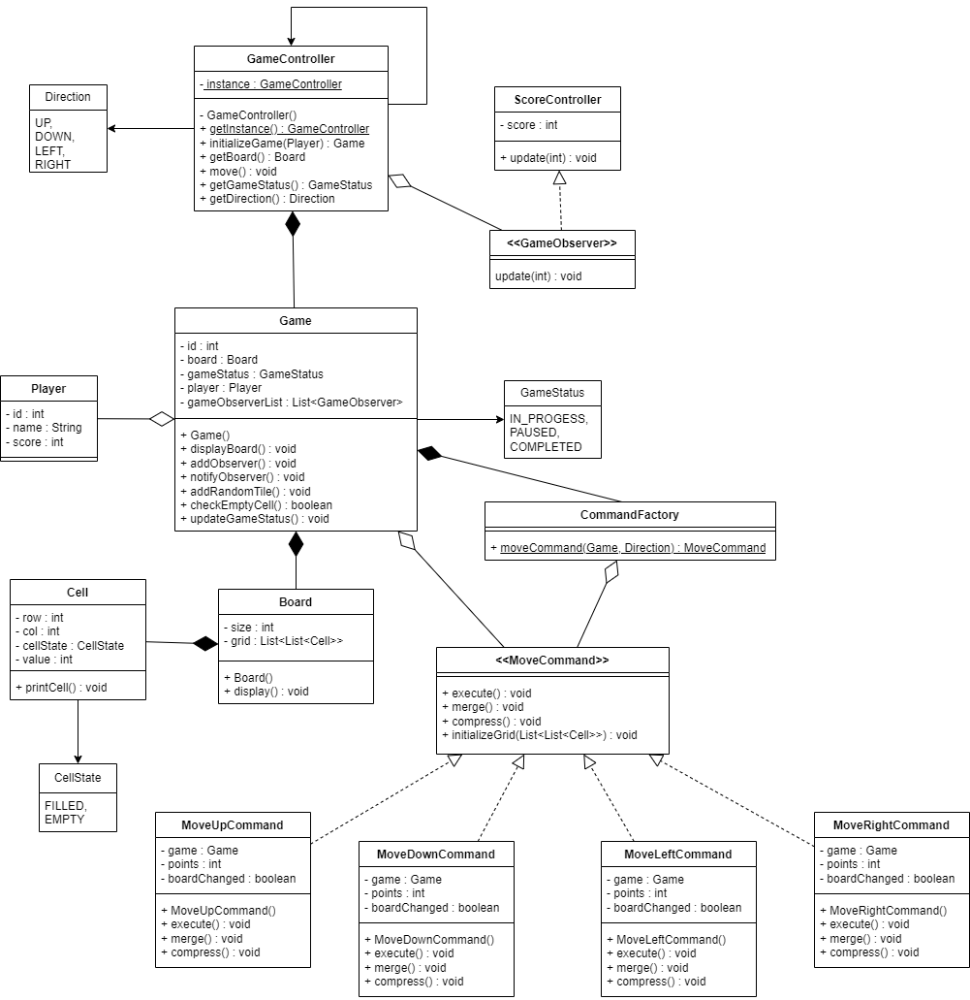

# Game 2048

## Requirements
1. The game is played on a 4x4 grid.
2. Tiles with numbers (powers of 2) are randomly placed on the grid.
3. Initially two tiles with a value of 2 or 4 are placed randomly on the grid.
4. Tiles can be moved in four directions: UP, DOWN, LEFT and RIGHT.
5. When a player makes a move, all tiles on the board slide as far as possible in the chosen direction.
6. When two tiles with the same number collide while moving, they merge into a tile with the sum of their values.  
For example, if two tiles with the number 2 collide, they merge into a single tile with the number 4.
7. The player earns points for every merged tile.
8. The game ends when there are no more valid moves (i.e. the grid is full, and no tiles can be merged).

## Solution

### Class Diagram

### Design Patterns

- **Singleton Pattern:** GameController as a singleton to manage the game state.
- **Observer Pattern:** Subject is GameController and Observer is ScoreController.
- **Command Pattern:** Command interface and concrete command classes for different user inputs.  
Example: MoveLeftCommand, MoveRightCommand, MoveUpCommand, MoveDownCommand.
- **Factory Pattern:** CommandFactory for creating instances of commands.

## How to Play
1. Run the **Main** class.
2. Enter Player Name.
3. Type "UP", "DOWN", "LEFT" or "RIGHT" to make a move.

